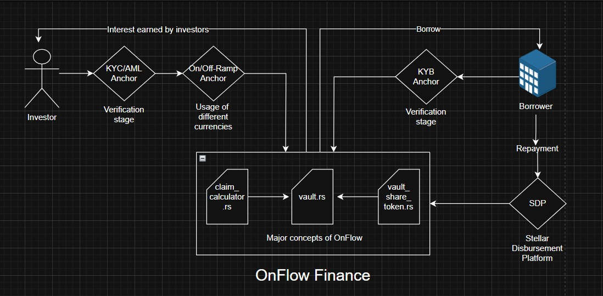

# OnFlow Stellar Hackathon Project - Technical Documentation

## Overview

**OnFlow: Global Private Credit for Everyone, Built on Stellar**

Access to capital remains one of the most significant barriers for small and medium-sized enterprises (SMEs) worldwide. Despite contributing over 50% of global employment, SMEs face a $5.7T annual financing gap. Traditional credit systems are centralized, slow, and biased toward large institutions. Retail investors, on the other hand, have limited access to direct, yield-generating credit opportunities.

OnFlow solves this by building a decentralized private credit marketplace on Stellar. It allows global investors to fund growing SMEs directly through programmable vaults, enabling yield-bearing investments in real businesses — with no minimum investment, no intermediaries, and fast settlement.

**Hackathon Deliverables**
We built three foundational components:

* **Credit Vaults**: Smart contracts that structure deposits, withdrawals, and repayments transparently
* **Vault Share Tokens**: SEP-41 compliant, yield-bearing instruments representing investor positions
* **SDP Integration**: Seamless, compliant disbursement of credit to SMEs

## What We Have Done in Hackathon

During the Stellar Hackathon, we developed OnFlow entirely from scratch on Soroban — Stellar's smart contract platform. We designed and implemented custom contracts using Rust and modular architecture.

A major inspiration for our architecture was the **ERC-4626 standard** on EVM chains. ERC-4626 has transformed yield-bearing vault design in DeFi by standardizing deposit, withdrawal, and share accounting across protocols. Projects like **Morpho** leverage 4626 vaults to build capital-efficient lending layers on top of base assets.

We aimed to bring a similar structure to Stellar using Soroban. Our vaults are structured to accept stablecoin deposits, issue share tokens, and manage proportional repayments through a unified interface — mirroring the transparency and efficiency of ERC-4626 in a non-EVM environment.

In addition:

* We built a mock version of **Stellar Disbursement Platform (SDP)** to simulate compliant fund transfer to borrowers.
* This lays the groundwork for full integration with SDP in the future, including real-time fiat disbursement and large-scale payout automation.

## Why Stellar?

Stellar provides unmatched advantages:

* Anchors offer fiat on/off-ramp access globally, enabling participation from underserved markets.
* Stellar Disbursement Platform (SDP) allows compliant, scalable fund disbursement.
* Soroban's native authorization and contract-to-contract interactions enable robust credit logic.

## Deployed Contracts (Testnet)

Here are the addresses of the core contracts deployed on the Stellar Testnet:

| Contract              | Address                                                              |
| --------------------- | -------------------------------------------------------------------- |
| **Vault System**      | `CBH4BB55IEP7O23T627DXH5EY53ALLFSWS72WTH3JM56GQLYPQB55ILM`             |
| **USDC Token**        | `CD6IS572QHURLTR3JRUUPPXES554NRXLHJRNB2QWWJGZJFLQAUTSTEQM`             |
| **Vault Share Token** | `CD67IXVOM7FAC6KZSLMYDT7PGR2OSA22NV7OC3CUSMINQMCRFFTHSDNK`             |

## Architecture Diagram

### Extended Architecture View



This extended diagram illustrates the flow between users (investors and borrowers), compliance layers (KYC/KYB Anchors), tokenized vault infrastructure, and the Stellar Disbursement Platform (SDP). Anchors handle verification and on/off-ramping, while smart contracts (`vault.rs`, `vault_share_token.rs`, `claim_calculator.rs`) manage deposits, repayments, and investor share logic.

The architecture consists of two verified user journeys:

* **Investor** goes through KYC/AML and On/Off-Ramp Anchors before depositing into vaults. They earn interest proportionally via vault\_share\_token.rs.
* **Borrower** undergoes KYB verification and, if approved, receives funds via the Stellar Disbursement Platform. They repay in installments, which are distributed to investors via claim\_calculator.rs.

All interactions are powered by modular Soroban smart contracts:

* `vault.rs`: Vault logic
* `vault_share_token.rs`: SEP-41 investor tokens
* `claim_calculator.rs`: Payout calculation logic

This ensures transparency, safety, and compliance.

## Folder Structure (Simplified)

```
onflow-stellar-master/
├── contracts/
│   ├── vault-system/
│   │   ├── vault.rs
│   │   ├── vault_factory.rs
│   │   ├── vault_share_token.rs
│   │   └── claim_calculator.rs
│   └── usdc_token/
├── frontend/
│   ├── src/
│   │   ├── components/
│   │   ├── pages/
│   │   └── App.jsx
│   └── public/
```

## Live Demo

[https://onflow-stellar.web.app/](https://onflow-stellar.web.app/)

## Authors

* Yağız Efe Özmeriç
* Eyüp Efe Karakoca
* Karan Kayaturan

## Roadmap (Planned Features)

OnFlow's post-hackathon roadmap includes:

* **Smart Wallet Integration**: Full support for Stellar Passkeys to enable seamless authentication and secure transaction signing.
* **Auto-Invest Functionality**: Investors will be able to set auto-invest rules (e.g. by sector, APY, or geography) and allocate capital automatically into verified vaults.
* **Portfolio Management Dashboard**: Users will manage their credit investments, returns, and repayment schedules through a rich visual interface.
* **Global On/Off-Ramp via MoneyGram**: Using Stellar's native MoneyGram integration, OnFlow will enable fiat-token conversion in 180+ countries, boosting liquidity and investor inclusivity.

These advancements will make OnFlow a truly borderless, compliant, and intelligent private credit marketplace.

## License

MIT
